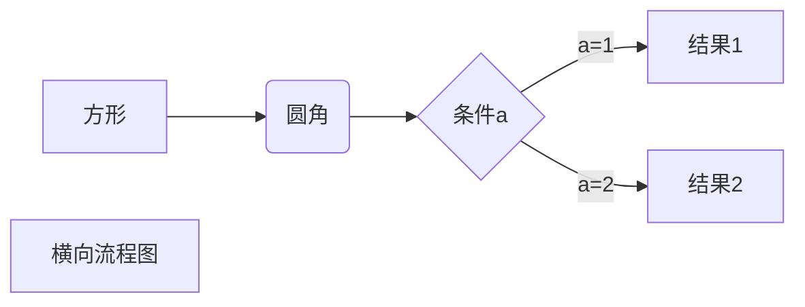
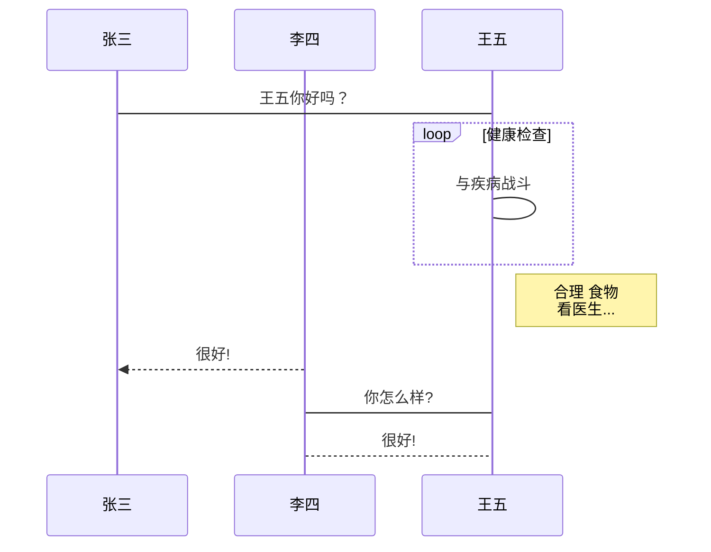
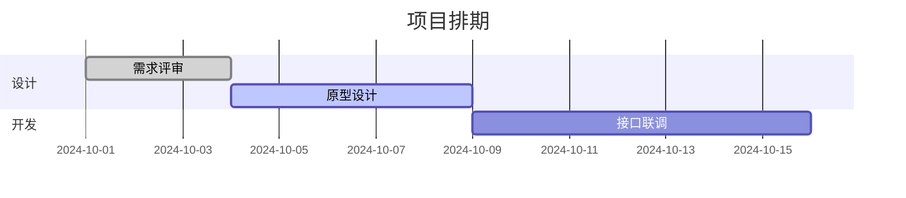

# Markdown 语法速查

## 标题

两种写法。Setext 式只能表示一、二级标题：

```markdown
我展示的是一级标题
================

我展示的是二级标题
---------------------------
```

ATX 式用 `#`，支持一到六级：

```markdown
# 一级标题
## 二级标题
### 三级标题
```

## 强调

| 写法                                     | 效果             |
| ---------------------------------------- | ---------------- |
| `*斜体文本*` 或 `_斜体文本_`             | _斜体文本_       |
| `**粗体文本**` 或 `__粗体文本__`         | **粗体文本**     |
| `***粗斜体文本***` 或 `___粗斜体文本___` | _**粗斜体文本**_ |

> 标记必须成对闭合，前后星号/下划线的个数要一致。

## 分割线

三个以上的星号、减号或下划线建立一条分割线，**行内不能有其他东西**。星号或减号中间也可以插入空格：

```markdown
****
* * *
******
- - -
---------
```

## 删除线与下划线

- 删除线用两个波浪号：`~~删除线~~` → ~~删除线~~
- Markdown 没有下划线语法，直接写 HTML：`<u>下划线</u>`

## 脚注

脚注由「引用」和「定义」两部分组成，缺一不可：

```markdown
正文里插入引用[^1]。

[^1]: 仰天大笑出门去
```

## 列表

**无序列表**用 `*`、`+`、`-` 标记，标记后加一个空格：

```markdown
* 第一项
* 第二项
```

**有序列表**用数字加 `.`：

```markdown
1. 第一项
2. 第二项
```

**嵌套列表**在子列表选项前添加四个空格：

```markdown
1. 第一项
    1. 第一项嵌套的第一个元素
    2. 第一项嵌套的第二个元素
```

## 区块引用

用 `>` 标记，多个 `>` 表示嵌套：

```markdown
> 区块最外层
>
> > 区块嵌套，第一层
> >
> > > 两个 >
```

**区块中使用列表**：

```markdown
> 1. 第一项
> 2. 第二项
>    + 嵌套项
```

**列表中使用区块**：在列表项下方缩进四个空格再写 `>`。

## 代码

行内代码用单反引号包裹：`` `printf()` ``。

代码块用三个反引号包裹，反引号后可以跟语言名做语法高亮：

````markdown
```javascript
$(document).ready(function () {
  alert('00');
});
```
````

## 链接

```markdown
[链接名称](链接地址)
[百度](https://www.baidu.com/)
```

也可以用尖括号直接写成自动链接：

```markdown
<https://www.baidu.com/>
```

或者用引用式，把地址集中放在文末：

```markdown
这是一个[引用式链接][1]。

[1]: http://www.google.com/
```

## 图片

语法和链接类似，前面多一个 `!`，第三个参数是可选的悬停标题：

```markdown


```

## 表格

```markdown
| 表头 | 表头 |
| --- | --- |
| 单元格 | 单元格 |
| 单元格 | 单元格 |
```

分隔行用 `:` 控制对齐：`:---` 左对齐，`:---:` 居中，`---:` 右对齐。

## 支持的 HTML 元素

Markdown 不覆盖的排版需求可以直接写 HTML，常用的有 `<kbd>`、`<b>`、`<i>`、`<em>`、`<sup>`、`<sub>`、`<br>`。

## 转义

在符号前加反斜杠 `\`，可以让它显示为普通字符而不被解析：

```markdown
**文本加粗**       ← 渲染成粗体
\*\*正常显示星号\*\*  ← 原样显示星号
```

## 图表

以下语法依赖渲染器支持（Typora、GitLab、部分 Markdown 编辑器）。

### 横向流程图

````markdown

````

### 竖向流程图

把 `graph LR` 换成 `graph TD` 即可。

### 标准流程图

````markdown
```flow
st=>start: 开始框
op=>operation: 处理框
cond=>condition: 判断框(是或否?)
sub1=>subroutine: 子流程
io=>inputoutput: 输入输出框
e=>end: 结束框
st->op->cond
cond(yes)->io->e
cond(no)->sub1(right)->op
```
````

横向版本在节点后加方向：`st(right)->op(right)->cond`、`cond(yes)->io(bottom)->e`。

### UML 时序图

````markdown
```sequence
Title: 标题：复杂使用
对象A->对象B: 对象B你好吗?（请求）
Note right of 对象B: 对象B的描述
Note left of 对象A: 对象A的描述(提示)
对象B-->对象A: 我很好(响应)
对象B->小三: 你好吗
小三-->>对象A: 对象B找我了
Note over 小三,对象B: 我们是朋友
participant C
Note right of C: 没人陪我玩
```
````

Mermaid 版本的时序图语法不同，`->` 是直线、`-->` 是虚线、`->>` 是实线箭头：

````markdown

````

### 甘特图

````markdown

````
